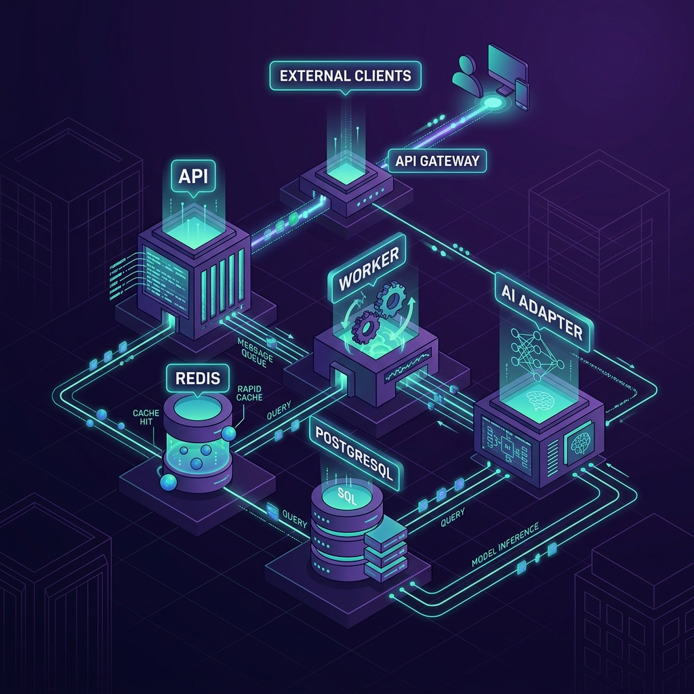

# 🏗️ Node Stack: High-End SaaS Boilerplate



> **"Architecture first, Boilerplate second."**
> A production-grade, ultra-resilient, and distributed NestJS monorepo optimized for elite SaaS products.

Node Stack is not just a collection of libraries; it's a **Technical Foundation**. Designed for developers who value transactional consistency, multi-tenant isolation, and horizontal scalability above all else.

---

## 🏛️ The Philosophy

Unlike generic boilerplates that focus on UI components, Node Stack focuses on the **Lower Layers**:
- **Atomic Operations**: Financial and metadata integrity via the Unit of Work pattern.
- **Distributed Reliability**: Microservice-ready event flows via the Transactional Outbox Pattern.
- **Strict Isolation**: Native multi-tenancy baked into every guard, decorator, and repository.
- **AI-Native**: Built-in background processing for heavy LLM tasks with BullMQ.

---

## 🚀 Production-Ready Modules

| Module | Capability | Implementation Detail |
| :--- | :--- | :--- |
| **🔐 Auth** | Enterprise Authentication | JWT + Refresh Tokens + Google/GitHub OAuth + 2FA support. |
| **📂 Workspaces** | Native Multi-tenancy | Advanced Member Roles (RBAC), Permission-based Access, and Slug management. |
| **💳 Billing** | Global Transactions | Multi-currency (USD/MXN), Polar.sh (exclusive) integration, and Idempotency. |
| **📁 Storage** | Secure Asset Management | High-performance direct-to-S3 uploads with presigned URL validation. |
| **🤖 AI Engine** | Scalable Inference | Decoupled background workers for LLM tasks with job tracking. |
| **🔗 Webhooks** | Outbound Resilience | Resilient dispatcher with circuit breakers and outbox consistency. |

---

## 🛠️ Infrastructure Stack

- **Core**: [NestJS](https://nestjs.com/) + [TypeScript](https://www.typescriptlang.org/)
- **ORM**: [Drizzle](https://orm.drizzle.team/) (PostgreSQL) — Zero overhead, maximum speed.
- **Cache & Jobs**: [Redis](https://redis.io/) + [BullMQ](https://docs.bullmq.io/).
- **Docs**: [OpenAPI (Swagger)](http://localhost:4000/api/docs) — Fully decorated for elite DX.
- **Validation**: [Zod](https://zod.dev/) — Single source of truth for runtime and type safety.

---

## 🏁 Quick Start

### 1. Initialize the Environment
```bash
pnpm install
docker-compose up -d
```

### 2. Configure Environment Variables
Copy `.env.example` to `.env` and configure your Database/Redis URLs and OAuth secrets.

### 3. Run Development
```bash
pnpm dev
```
- **API**: `http://localhost:4000`
- **Docs**: `http://localhost:4000/api/docs`
- **Worker**: Runs in the background for your jobs.

---

## 🧪 Testing with Postman

We provide a high-fidelity Postman collection and environment for local development:

1.  **Import**: Import the files from the `./postman` directory into Postman.
2.  **Environment**: Select the `Node Stack (Local)` environment.
3.  **Variables**: The collection uses the `{{access_token}}` variable for authentication, which is automatically updated upon a successful login/register request via test scripts.

---

## 📚 Technical Documentation

- **[Documentation Index](./docs/README.md)**: Explore the definitive guides for architecture, database, security, docker, and observability.
- **[OpenAPI / Swagger Specs](http://localhost:4000/api/docs)**: Explore the fully documented API surface.

---

Built for **Performance**. Built for **Scale**. Built for **You**.
