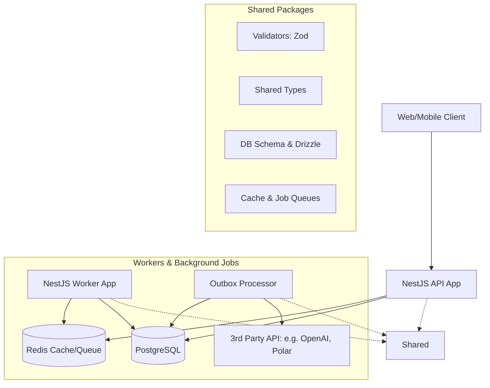

# 🏗️ Node Stack Architecture

This document outlines the core architectural principles, design patterns, and event flows used in the Node Stack. It is designed for high performance, transactional consistency, and multi-tenant isolation.

## 🏛️ High-Level Component Overview

---

## 🔒 1. Multi-Tenant Isolation (Workspace Scoping)

The core of Node Stack is a strict multi-tenant architecture. Every request is scoped to a `Workspace` using the following mechanism:

- **Guard (`WorkspaceGuard`)**: A global or route-level guard that extracts the `workspaceId` (usually from a header like `X-Workspace-Id` or a URL parameter).
- **Decorator (`@TenantId()`)**: A custom decorator that injects the validated workspace context into the controller methods.
- **Repository Pattern**: All database operations include an implicit (or enforced) `tenantId` (workspaceId) filter.
- **Cache Isolation**: Keys in Redis are prefixed with the workspace ID (e.g., `ai:job:{workspaceId}:{jobId}`).

---

## 💎 2. Transactional Consistency (Unit of Work)

To ensure data integrity during complex operations (e.g., creating a workspace and setting up its initial billing plan), we use the **Unit of Work** pattern implemented via a transactional helper.

- **Pattern**: `withTransaction(async (tx) => { ... })`
- **Benefit**: All operations within the block succeed or fail atomically.
- **Reliability**: Essential for financial transactions (Billing) and critical metadata changes.

---

## ⚡ 3. The Outbox Pattern & Event Flow

To maintain high availability and decoupling between services, Node Stack implements the **Transactional Outbox Pattern**. This prevents "Dual Writes" (e.g., database update succeeding but external webhook failing).

### The Flow:
1.  **API Command**: An incoming request modifies the database state (e.g., `ApiKeysService.revoke`).
2.  **Atomic Event Persistence**: Within the *same transaction*, a record is inserted into the `outbox` table.
3.  **Outbox Worker**: A background process polls the `outbox` table or listens for `NOTIFY`.
4.  **Reliable Dispatch**: The worker processes the event (e.g., invalidating Redis cache, sending a webhook via `WebhookDispatcher`).
5.  **Completion**: The event is marked as processed or moved to a Dead Letter Queue (DLQ) if all retries fail.

---

## 🤖 4. AI Processing Pipeline

Heavy AI tasks (e.g., prompt generation, training) are offloaded to background workers using **BullMQ**.

- **Enqueuing**: The API submits a job to the `ai` queue.
- **Tracking**: The client receives a `jobId` immediately and polls for status.
- **Worker Execution**: The `Worker` app consumes the job, interacts with OpenAI/Anthropic, and updates the state.
- **Result Caching**: Results are stored in Redis with a TTL for efficient retrieval.

---

## 📁 5. Reliable Storage & Direct Uploads

We avoid proxying large files through the API to minimize latency and resource usage.

- **Presigned URLs**: The API validates the file metadata and returns a secure, time-limited S3 upload URL.
- **Confirmation Flow**: The client uploads directly to S3 and then notifies the API to "Confirm" the upload, triggering metadata verification (size check, path verification).

---

## 🔐 6. Security & Authentication

- **Dual-Auth**: Supports both standard **JWT (Bearer)** for interactive users and **API Keys** for programmatic access.
- **RBAC**: Role-Based Access Control mapped to specific permissions (e.g., `WORKSPACE_WRITE`).
- **Idempotency**: Critical endpoints use an `IdempotencyInterceptor` with Redis to prevent duplicate processing of the same request.
