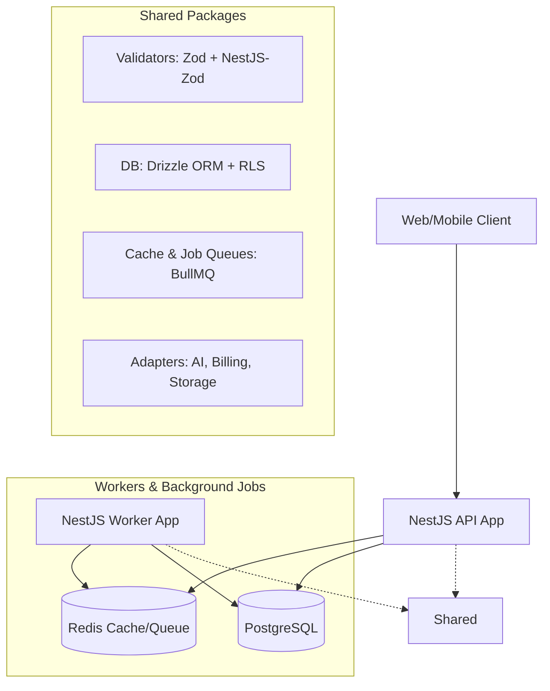

# 🏗️ Node Stack Architecture

This document outlines the core architectural principles, design patterns, and event flows used in the Node Stack. It is designed for high performance, transactional consistency, and multi-tenant isolation.

## 🏛️ High-Level Component Overview

---

## 🔒 1. Multi-Tenant Isolation (Workspace Scoping)

The core of Node Stack is a strict multi-tenant architecture. Every request is scoped to a `Workspace` using a multi-layered defense strategy:

- **Guard (`WorkspaceGuard`)**: A global-ready guard that extracts the `workspaceId` (from headers, URL params, or API keys), verifies membership, and initializes the **AsyncLocalStorage** context.
- **Context (`RequestContextService`)**: Uses Node.js `AsyncLocalStorage` to propagate the current `workspaceId` and `userId` across the execution chain without manual prop-drilling.
- **PostgreSQL RLS (Row-Level Security)**: When using `withTransaction`, the system automatically executes `SET LOCAL app.current_workspace_id = ...`. This enables native database-level isolation if RLS policies are enabled on tables.
- **Cache Isolation**: Keys in Redis are automatically prefixed with the workspace ID to prevent cross-tenant data leakage.

---

## 💎 2. Transactional Consistency (Unit of Work)

To ensure data integrity during complex operations, we use a robust transaction wrapper that integrates with the request context.

- **Pattern**: `withTransaction(async (tx) => { ... })`
- **Context Integration**: Automatically sets the tenant context inside the transaction for RLS compatibility.
- **Retry Logic**: `withRetry` helper handles transient connection issues or PgBouncer timeouts with exponential backoff.

---

## ⚡ 3. Background Processing & Resilience

To maintain high availability and prevent "Dual Writes", Node Stack leverages **BullMQ** and the **Outbox Pattern**.

### The Flow:
1.  **API Command**: An incoming request modifies the database state.
2.  **Outbox Persistence**: Events are saved to the `outbox` table within the same transaction.
3.  **Reliable Dispatch**: A background worker (using BullMQ) consumes these events, ensuring they are delivered even if the primary API is under load.
4.  **Idempotency**: Critical endpoints use an `IdempotencyInterceptor` with Redis to ensure that retried requests (due to network failures) don't trigger duplicate side-effects.

---

## 🤖 4. AI & Heavy Task Pipeline

Heavy AI tasks (e.g., prompt generation, training, streaming completions) are offloaded to decoupled background workers.

- **Job Tracking**: The API enqueues a job and returns a `jobId`.
- **Worker Execution**: The `Worker` app consumes the job from BullMQ, interacts with AI adapters (OpenAI, Anthropic), and updates progress.
- **State Polling**: Clients can poll the status or receive updates via WebSockets (`RealtimeModule`).

---

## 📁 5. Reliable Storage & Direct Uploads

We use the "Presigned URL" pattern to offload bandwidth from the API.

1. **Request**: Client asks for an upload URL for a specific context (avatar, document).
2. **Policy Check**: API validates if the file size and mime-type are allowed for that specific context.
3. **Presigned URL**: API returns a short-lived S3 URL.
4. **Direct Upload**: Client uploads to S3.
5. **Confirmation**: Client notifies the API, which verifies the metadata before marking the file as "complete".

---

## 🔐 6. Security & Observability

- **Dual-Auth**: Native support for **JWT** (for users) and **API Keys** (for machines) with unified RBAC.
- **RBAC & Permissions**: Granular permission checks using `@RequirePermissions(Permission.WORKSPACE_WRITE)`.
- **Structured Logging**: Using **Pino** with trace/span correlation via **OpenTelemetry**.
- **Real-time Monitoring**: Integrated with **Prometheus** metrics and **Sentry** for error tracking.
